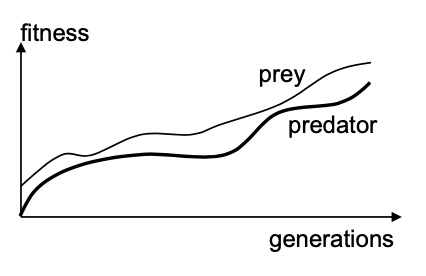

# Check Points Bio-Inspired Artificial Intelligence 

This is a series of check points (in the form of questions) that you can use to check if you understood the main points of each lecture.

- [Table of Contents](#check-points-bio-inspired-artificial-intelligence)
  * [1 Introduction](#1-introduction)

  * [2 Evolutionary Algorithms I](#2-evolutionary-algorithms-i)

  * [3 Evolutionary Algorithms II](#3-evolutionary-algorithms-ii)

  * [4 Multi-Objective Evolutionary Algorithms](#4-multi-objective-evolutionary-algorithms)

  * [5 Constrained Evolutionary Algorithms](#5-constrained-evolutionary-algorithms)

  * [6 Swarm Intelligence I](#6-swarm-intelligence-i)

  * [7 Swarm Intelligence II](#7-swarm-intelligence-ii)

  * [8 Neuro-evolution](#8-neuro-evolution)

  * [9 Swarm and Evolutionary Robotics](#9-swarm-and-evolutionary-robotics)

  * [10 Competitive and Cooperative Co-Evolution](#10-competitive-and-cooperative-co-evolution)

  * [11 Genetic Programming](#11-genetic-programming)

  * [12 Applications & Recent Trends](#12-applications---recent-trends)


## 1 Introduction

#### What is a tentative definition of Artificial Intelligence?

The ability to perform a choice from a set of options in order to achieve a certain objective

#### What are the classic and modern paradigms of Artificial Intelligence?

The goal was to achieve human cognition, now the goal is to possibly go beyond human capabilities 

#### What are the main features of Computational Intelligence algorithms?

Learn or adapt to new situations, generalise, abstract, discover, associate

#### What are the main approaches for global and local optimization?

For **local** optimization we have gradient based methods (Gradient descent, Newton methods, Quasi-Newton methods) and heuristic methods (Rosenbrock, Nelder-Mead, Hooke-Jeeves, etc.)
For **global** optimization we can have unimodal or multimodal functions and we have 2 approaches: Deterministic and Stochastic

#### What are the main difficulties that can be met in optimization problems?

High non-linearities, high multimodality, noisy object function, approximated object function

#### What is a metaheuristic?

A metaheuristic is an algorithm that doesn't require any assumption on the objective function. In short any stochastic optimization algorithm.

#### What is the main idea of the No Free Lunch Theorem?

Every problem should be solved with a proper algorithm that is tailored arounds its features. 

#### What are the 4 pillars of evolution?

**Population**, **Diversity** (through mutation), **Heredity**, **Selection**

#### What is phenotype and genotype?

**Genotype** is the genetic material of the organism, is transmitted during reproduction and the mutation and the crossover affect it.
**Phenotype** is the manifestation of an organism, affected by the enviroment, development, selection operates on it.

#### What’s the difference between Darwinian and Lamarckian evolution?

**Lamark**: all acquired characteristics are transmitted to the offspring
**Darwin**: only useful variations are transferred, survival of the fittest

#### What is the fitness landscape?

In evolutionary biology, fitness landscapes or adaptive landscapes are used to visualize the relationship between genotypes and reproductive success. It is assumed that every genotype has a well-defined replication rate. This fitness is the "height" of the landscape. Genotypes which are similar are said to be "close" to each other, while those that are very different are "far" from each other. The set of all possible genotypes, their degree of similarity, and their related fitness values is then called a fitness landscape.

#### What are the similarities and differences between natural and Artificial Evolution?

**Similarities:**

* *Individual*: a candidate solution for a given problem: phenotype+genotype
* *Population*: a set of individuals
* *Diversity*: A measure of how individuals in a population differ
* *Selection*: A mechanism to select which individuals survive and reproduce
* *Inheritance*: A mechanism to partly transmit the properties of a solution to another individual.

**Differences:**

* Fitness is a measure of how good a solution is, **not** the number of offspring
* Selection is based on fitness, **not** on competition and interactions
* Generations are not overlapping, parents and offspring **don't** exist at the same time
* We expect an improvement between the initial and final solution, **natural evolution is not an optimization process**

#### What are the key elements of Evolutionary Algorithms?

There are two key elements in EAs: An **individual** that encodes a potential solution for a given problem and at each individual is assigned a **fitness** that is a metric of how good that solution is for a specific problem.

#### Why and how do Evolutionary Algorithms work?

Classical algorithms work on a single solution at the time, aren't parallelizable and aren't good for exploring the fitness landscape. But EAs are highly parallelisable, are good at exploitation and exploration, every solution can be perturbed differently and solutions can interact with crossover.

#### What are the main principles of Swarm Intelligence?

Swarm intelligence is a the propery of a system where the collective behaviour of multiple agents interacting causes an emergent behaviour.

* The agents perceive and act based only on local information
* Agents cooperate by means of local information
* Information propagates through the entire swarm
* The result is distributed problem solving

#### Can you mention some natural examples of emergent behavior?

  Without leader: Termite nests, with learder: V flock formation

#### What are the main principles and challenges of (computational) Swarm Intelligence?

  Principles:

  * Unity is strength
  * Resilience, individuals are disposable 
  * Locality: individuals have simple abilities and the only have theri local sensory information, they also perform simple actions

  Challenges:

  * Find individual behavioural rules that result in the desired swarm behaviour by reverse engineering. (They can be obtained automatically by EAs)
  * Make sure the emergent behaviour is stable.

#### What are Reynolds’ flocking (BOIDS) rules? 

1. Separation
2. Cohesion
3. Alignment 

## 2 Evolutionary Algorithms I 

#### What are the main steps of an EA generation cycle?

  1. Find a genetic representation 
  2. Build a population
  3. Design a fitness function
  4. Choose selection method
  5. Choose replacement method
  6. Choose crossover and mutation
  7. Choose data analysis method
  8. Repeat until:
     * a maximum fitness value is found
     * a solution is good enough
     * a time limit
     * a certain convergence condition is met

#### What is a discrete representation?

A discrete representation is our way of storing the genotype which can be mapped into different phenotypes depending on the optimization problem

#### How can you represent a real value with a binary representation?

With the [IEE754](https://en.wikipedia.org/wiki/IEEE_754) or others, it depends on the precision we want

#### How can you represent a sequence with a discrete representation?

By using the gene position to identify an object of the sequence and the value as value

#### What are real-valued representations and when may be used?

The genotype is sequences of real values that represent the problem parameters.
Used when high precision parameter optimization is required 

#### What are tree-based representations?

The genotype describes a tree with branching points and terminals.

#### What are the main methods to create the initial population in EAs?

First we should have a sufficiently large population to cover the search space, but also small for evaluation.
Then we create each individual from an uniform sample of the search space.

#### How does fitness-proportionate selection work?

The probability that an individual makes an offspring is proportional to how good his fitness is wrt the population fitness. This biases the selection towards the most fit individual. 

#### When does fitness-proportionate selection fail and why?

The fitness must be positive, with uniform fitness values it becomes random selection, with few high fitness individuals the low fitness ones have almost zero chance of reproducing.

#### How does rank-based selection work?

Individuals are sorted on their fitness value. The index on the list is the rank. Selection pressure wrt fitness proportionate selection `p(i)=1-r(i)/∑r`

#### How does truncated rank-based selection work?

  Only the best **x** individuals are allowed to make offsprings and each of them makes the same number of offsprings: **N/x** where N is the population size.  

#### How does tournament selection work?

For every offspring to be generated:

1. Pick randomly k individuals from the population, where k is the tournament size (< N)
2. Choose the individual with the highest fitness and make a copy
3. Put all individuals back in the population

#### What is elitism?

Maintain the best *n* individuals from previous generation to prevent loss of best individuals by effects of mutation or sub-optimal fitness evaluation

#### How does crossover work for different representations?

* One point: decide an index where to split the genome
* Uniform: for each value randomly choose on of the two parents
* Arithmetic: arithmetic average of the two genomes
* Sequences: create a new sequence with some elements in the same order of the parent
* Trees: Cut and paste

#### How does mutation works for different representations?

* Binary: random mutate some bits
* Real valued: increase or decrease some elements
* Sequence: randomly swap elements
* Trees: randomly change

#### How can you monitor the performance of an evolutionary algorithm?

* By tracking the best/worst population average fitness of each generation
* Multiple runs are necessary 
* Fitness graphs are meaningful only if the fitness function doesn't change over time, these plots can be used to detect if the algorithm stagnated or converged.

#### Why is it important to monitor diversity?

Diversity tells where there is potential for further evolution.

#### What’s the main idea of the schemata theory?

**DEF**: a schema is a set of individuals with some common genes.

**DEF**: The order of a schema is the number of common genes

**DEF**: The defining length of a schema is the longest between two defined positions, including the initial one

**Building Block Hypothesis**: a GA seeks near optimal performance through the closeness of short, low order, high performance schemata called the building blocks 

## 3 Evolutionary Algorithms II

#### What is the advantage of using an adaptive mutation step-size in Evolution Strategies?

It allows us to have a more explorative behavior at the beginning in order to ignore local optimums, and to have a more exploitative behavior at the end.
#### What are the three self-adaptive mutation strategies used in Evolution Strategies?

* Uncorrelated mutations with one mutation step size `(x1,…,xn,σ)`
* Uncorrelated mutations with multiple step size `(x1,…,xn,σ1,…,σn)`
* Correlated mutations individuals are represented as `(x1,…,xn,σ1,…,σn,ɑ1,…,ɑn)`

#### Why is it useful to use correlated mutations in Evolution Strategies?

It allows us to follow the optimum even when the fitness landscape is skewed. 

#### How can the pairwise dependency between n variables be represented?

With a covariance matrix

#### What’s the difference between (μ, λ)-ES and (μ + λ)-ES?

 They are both deterministic rank-based selection methods

* μ indicates the number of parents
* λ is the number of offspring produced
* (μ, λ) selects the best μ individuals from λ offspring
* (μ+λ) selects the best μ individuals from both μ parents and λ offspring

#### What are the main advantages of CMA-ES?

During the search it gathers information on unsuccessful mutations thus builds an evolution path. 

This evolution path is used to adapt both the step size by shrinking or amplifying it for successful mutations and the covariance matrix by rotating and adjusting it to adapt to the fitness landscape.

#### What are the deterministic and stochastic selection schemes in Evolutionary Programming?

* Deterministic traditional
  * μ parents and μ offspring are taken into account and sorted on fitness.
  * the best μ solutions are selected for the next generation
* stochastic modern
  * μ parents and μ offspring are taken into account and sorted on fitness
  * each solution is evaluated against *q* randomly chosen from  the parents and offspring, and we keep count of the number of "wins" as relative fitness
  * The relative fitness is used for selecting the next generation

#### What are the main operators of Differential Evolution?

?

#### What are the main parameters of Differential Evolution? 

Population size, Scale Factor (aka differential weight), Crossover probability

#### What’s the difference between exponential and binomial crossover used in DE?

* binomial follows a binomial distribution, avg of swapped genes = 1 + CR*n
* exponential follows a geometric dist. avg = (1-CR^n)/(1-CR)

#### Why and how does Differential Evolution work?

At the beginning, the solutions are spread out, with a large **S**cale **F**actor allows for large search moments. (EXPLORATIVE BEGINNING)

At the end of the optimization, the solutions should be focused in an area of the decision space, allowing for refinements. (EXPLOITATIVE ENDING)

TLDR: Progressively shrinking randomized movements guide the search towards the optimum.

#### What are the differences between classic Evolutionary Algorithms and EDAs?

In EDAs we don't evolve solutions, but **a single** probabilistic model of the population.

#### How does PBIL work?

Genes are represented as real values in the range [0,1] indicating the prob. that any allele appears in that gene

1. A population is generated from the probability vector
2. The fitness of each member is evaluated and ranked
3. Update population genotype based on fittest individual
4. mutate
5. repeat

## 4 Multi-Objective Evolutionary Algorithms 

#### Can you mention some examples of Multi-Objective Optimization problems?

Buying a car: comfort vs price
Engineering design: lighness vs strength

#### What are some of the drawbacks of combining criteria into a single fitness function?

To find different tradeoff solutions we must re-optimise the weights.

#### How does lexicographic ordering work?

The objectives are ranked in a user-defined order of importance, so we optimise each objective, restricting every time.

#### How does the ε-constraint method work?

There are k single objective optimization problems that are solved separately, imposing for every problem k-1contraints that correspond to the other problems.

#### What does it mean for one solution to Pareto-dominate another solution?

A solution *i* is said to "Pareto-dominate" a solution *j* if *i* is **not worse** than *j* on every objectives, **AND** if *i* is **better** than *j* **on at least one objective**.

#### What is the Pareto-optimal front?

A pareto-optimal front is **a set** that contains **all** the **solutions that are not dominated** by any other.

#### What’s the difference between local and global Pareto front?

The global pareto front is the pareto-optimal front in all the fitness function, a local pareto front is the optimal in a subset of the fitness function.

#### Why is it useful to find a Pareto-optimal front?

When the decision about a problem are made after the optimization.

#### What’s the difference between a priori and a posteriori Multi-Objective Optimization?

In "a priori" methods the decisions about a problem are before the optimisation, whereas in "a posteriori" methods the decisions are made after the optimisation.

#### What are the important aspects to take into account for Multi-Objective EAs?

* Fitness assignments, by means of:
  * Weighted sum, the weights are adapted during evolution
  * Separate evaluation of each objective by a subset of the population
  * Pareto-dominance
* Diversity preservation
  * Fitness sharing
  * Crowding distance sorting
* Memory of all the non-dominated points 
  * an archive of non-dominated points (to expand the current population)
  * elitist selection

#### How does VEGA work?

First it evaluates each solution for every objective function separately, then for each objective selects the best N/k individuals and puts the bests into a single final population

#### What is the “Pareto rank” that is used in NSGA-II, and how is it used?

Solutions can be ranked according to their level of dominance: non dominated solutions have rank 1, then we get rank 2... recursively

#### What is the “crowding distance” that is computed in NSGA-II, and how is used? 

It is used as a diversity preservation mechanism

## 5 Constrained Evolutionary Algorithms 

#### What kind of constraints can an optimization problem have?

**Hard-constraints** which set conditions that are requred to be satisfied and **soft-constraints** which have some variables values that are penalised in the objective function.

#### What does it mean for a solution to be infeasible?

That some hard-constraints are not satisfied.
#### What are the main kinds of penalty functions that can be used in EAs?

* Death Penalty: when a solution violates a constraint it is rejected
* Static Penalty: the penalty functions remains constant during the evolution process
* Dynamic Penalty: the penalty function changes depending on the generation
* Adaptive penalty: the penalty function takes a feedback from the search process

#### What are the main issues of penalty-based approaches?

* The penalty factors are highly problem dependent.
* If the penalty is too high or low the optimization process may not be efficient

#### How does ASCHEA work?

It has 3 main components:

* An adaptive penalty function
* A recombination operator guided by the constraints, that mixes an infeasable solution with a feasible one
* A "Segregational selection operator": Aims to define the ratio of feasible solutions in the next population

#### How does stochastic ranking work?

It consists of multi-membered Evolution strategies that use a penalty function and a selection based on a ranking process. It tries to balance the influence of the objective function and the penalty function when assigning fitness to a solution. It doesn't requre the definition of a penalty factor.

#### How does constraint domination (Pareto ranking) work?

#### How can the notion of Pareto-dominance be adapted to problems with constraints?

* Single objective (comparison of two solution):
  * both are feasible -> choose the solution with higher fitness
  * One is feasible, the other not -> choose the feasible
  * Both infeasible -> choose the one with smaller overall contraint violation
* Multi objective (a solution *i* constrained-dominate solution *j* if any of the below)
  * *i* is feasible and *j* not
  * *i* and *j* infeasible, but *i* has smaller constraints violations
  * Solution *i* and *j* are both feasible, and *i* pareto-dominates *j*

#### What’s the rationale behind repair mechanisms?

It is an approach to turn unfeasible solutoins into feasible ones.
This can be done through greedy algorithms, random or custom herustics.

#### How can repaired solutions be used?

Repaired solutions can be used for firness evaluation only or to replace the corrisponding unfeasible solutions in the population (always or with some propbability).

#### What’s the main idea of the Ensemble of Constraint-Handling Techniques?

To have several constraint handling techniques, each with its own popultaion and parameters. Each population produces its offspring and evaluates them. However, the offspring compete with all the offsprings from all the populations. This aims to automate the selection of the best constraint-handling technique for a certain problem (no free lunch theorem)

#### What’s the main idea of Viability Evolution?

Progressively shrinking the boundaries of unfeasible solutions.

## 6 Swarm Intelligence I

#### What is the biological inspiration of Particle Swarm Optimization?

A flock of birds that wants to find the area with the highest concentration of food. Birds don't know where the area is, but each bird can tell its neighbors how many insects are at its location, also each birds remenbers its own location where it found the highest concetration of food so far.

#### What are the three strategies adopted by birds in a flock?

1. **Brave**: keep flying in the same direction
2. **Conservative**: fly back towards the best position
3. **Swarm**: move towards the best neighbor

#### How can a “particle” be defined and what kind of information does it have?

A particle can be defined as **position**, **velocity** and **performance** and it has perception on the **performance of neighbors**, the best particle among its **neighbors and its position**, its **best position**.

#### What are the main neighborhood levels and social structures that can be used in PSO?

**Global** neighborhood, **distance** based neighborood, **list** based neighborhood, ring, star, von-neumann,pyramid, clusters, wheel...

#### What’s the idea behind growing neighborhoods?

Start with a ring topology with least connectivity, then grow towards a star topology. Particles are added to the neighborhood according to a scaled euclidiean distance smaller than an increading radius.

#### What are the main steps of (standard) Particle Swarm Optimization?

* Each particle is initialized with random position and velocity
* At each step, each particle updates **first the velocity:** $$v'=w*v+\phi_1U_1\cdot(y-x)+\phi_2U_2\cdot(z-x)$$, where **x** is the current position and **v** the current velocity. **y** and **z** are the personal and social best position. **w** is inertia $$\phi_1$$ and $$\phi_2$$ are the cognitive and social coefficients. U1 and U2 are uniform random numbers
* **Then** each particles updates **its position**: $x'=x+v'$
* *If improvement* **update** personal **best** and social/global best, y and z respectively.
* **Repeat** all the above until a stopping criteria is met.

#### What are the velocity component and velocity models in PSO?

**Components:**

* Inertia velocity: the momentum, prevents drastic changes.
* Cognitive velocity: the nostalgia
* Social velocity: the envy

**Models:**

* Cognition only model: **Independent hill climbers**, local search by each particle
* Social-only model: the swarm is **one stochastic hill climber**

#### What is the effect of the acceleration coefficient parametrization?

ɸ1= cognitive ɸ2 = social

* ɸ1=ɸ2=0 then the particles moves only based on its inertia
* ɸ1>0, ɸ2=0 cognition only model
* ɸ1=0, ɸ2>0 social only model
* ɸ1=ɸ2>0 particles are attraccted towards the average of personal and social best
* ɸ1<ɸ2 better for unimodal
* ɸ1ɸ2 better for multimodal
* low ɸ1 and ɸ2 smoother trajectories
* high ɸ1 and ɸ2 higher acceleration, abrupt movemnts

#### What are the similarities and differences between EAs and PSO?

* in PSO we have the equivalent of **two populations** instead of one, because we have *personal best* solutions and the *current positions*
* PSO can be see as a **population based algorithm** where the particle position evolve over time
* The main difference is in the logic related to the selection:
  * **EAs**: **fitness based** and take into account the entire population
  * **PSO**: considers the solution **before and after the perturbations**, one to one spawning

#### Can you mention some examples of dynamic inertia rules?

Dynamic inertia, **w changes with time**. W is problem dependent. 

* **w≥1** velocity increases over time more **explorarion**. 

* **0<w<1** decelerate = more **expoitation**.

* W can be random sampled from gaussian dist.

#### What is velocity clamping and why is it needed?

In velocity clamping, a Vmax is defined and has the effect of controlling the global exploration of particles, it doesn't **confine** positions, but step sizes.

It is also possible to adaptively change Vmax if the global best doesn't improve over a cartain number of iterations. 

It is needed because **the velocity** of the particles **tends to increase quickly**, thus may lead to skipping some good solutions.

#### What is the main idea of Multi-Start PSO?

To increase diversity it continually **injects randomness** in the particles positions, however may also lead to never reaching equilibrium.

#### What’s the main idea of Comprehensive Learning Particle Swarm Optimization?

A **more efficient** version of PSO.

Changes to the perturabtion logic 


```tex
v_i^{k+1}=w v_i^k + \phi U\big(x_{lb-f}^k-x_i^k\big)
```

The **functional local best** is a solution composed of design variables taken from multiple particle personal bests selected according to this:

* For each *j*-th design var, a random number is generated and compare with a threshold
  * if it's higher, then it's copied from the personal best of the *i*-th particle
  * If it's lower, then two particles (≠*i*) are randomly selected from the swarm and the best of the two is copied

#### What’s the main idea of Cooperatively Coevolving Particle Swarms?

Randomly **divide** the problem into **n** separate sub-problems, doesn't use velocity update but samples solutions from different distributions.

Advantages:

* Instead of solving one large dimensional problem, **several smaller problems are solved**.
* Fitness is evaluated after each part of the context vector is updated, allowing for a **finer-grained search**.

#### Can you mention some hybrid variants of PSO?


## 7 Swarm Intelligence II

#### What is stigmergy?

The communication of individuals through changing in the enviroment.

#### How is stigmergy used by ants?

Ants leave a pheromone trail, ants follow the path with the highest pheromone concentration, in absence of pheromone random path.

#### What are the main principles of Ant Colony Optimization?

Assumes an optimization problem represented as a graph.
We build solutions at runtime.

There are **two** rules:

* the **transition** rule 
* the **pheromone update** rule.

When an ant steps on a node leaves pheromones that evaporate over time.

It has a constructive aspect to the solution, and this is different from the other metaheuristics.

When an ant completes a solution, it **lays pheromone on its path**. The amount of pheromone is **divided by the length of the path**. So edges that belong to **shorter paths have higer pheromone**.

#### What kind of problems can Ant Colony Optimization solve? Why?

  Combinatorial problems over networks and any problem that can be described as a TSP, logistics problems.

#### How does the transition rule used in ACO work?

It is used to encourage the choice of edges with high pheromone levels and short distances.

#### What’s the influence of the transition rule’s parameters α and β?

ɑ decides how much the ants will be looking for pheromones, β defines how important is the distance of the nodes.

*alpha=*👃 

*beta*=distance

#### How does the classic pheromone update rule used in ACO work?

The pheromone on an edge linearly decreases with time, but is increased by the transition of all ants on that edge rescaled by the length of each ant's path.

#### How do the local/global pheromone update rules used in ACO work?

**Local**: The pheromone level of each edge visited by an ant is decreased by a fraction $(1-\rho)$ of its current level and increased by a fraction $\rho$ of the initial level.

$\tau_{ij}(t+1)=(1-\rho)\cdot\tau_{ij}(t)+\rho\cdot\tau_{ij}(0)$

**Global**: Whel all ants have completed their paths, the length $L$ of the shortest path is found and **only the pheromone levels of the shortest path are updated**.

$\tau_{ij}(t+1)=(1-\rho)\cdot\tau_{ij}(t)+\frac{\rho}{L}$

#### How can you apply Ant Colony Optimization for shortest-path problems and TSP?

* Distribute m ants on random nodes
* Initial pheromone levels are equal for all edges and inversely proportional to the number of nodes times the estimated length of the optimal path. $\tau(0)=\frac{1}{n\cdot L^*}$

#### Can you mention some of the main variants of ACO?

* Ant Colony Systems (ACS): Has stronger explotiation, only the best ants can update the pheromone.
* Max-Min AS (MMAS): Only best ants can update the pheromone, with max and min values. More explorative.
* Elitist Pheromone Updates: Best ants add pheromone proportional to path quality
* Fast Ant System (FANT): only one ant, $\beta=0$, no evaporation.
* Antabu: local search based on tabu search.
* AS-Rank: only best ants update and elitist pheromone update§.

#### What are the main steps of Continuous Ant Colony Optimization?

CACO performs a bi-level search: local (exploit good regions) and global (explore bad regions) 

* Initialization
  * Search is performed by $N_k$ ants: $N_l$ for local search and $N_g$ for global search
  * create $N_r$ regions
    * each region is a point in the continuous space
  * Set pheromone of each region to 1
* Local search
  * each ant of the $N_l$ local ants selects a region with a probability and moves a distance defined by the user.
* Global search
* Region age and pheromone update
  * the age of a reagion idicates the weakness of a solution
  * if a better fitness is not found the age is increased, otherwise region is replaced with 0 age

#### What are the two main methods for Multi-Objective Ant Colony Optimization?

Multi-pheromone approach with one pheromone for each objective

Multi-colony approach with one colony for each objective

#### How does the multi-pheromone approach work?

A pheromone and an herustic matrix are used fore each objective.


Pheromones update rules:

* Only ants that generated non dominated solutions can update both pheromone matrixes 
  * These ants deposit 1/np the quantity of pheromone, where np is the number of 🐜 that generated non-dominated solutions
* All non dominated solutions are stored in an archive 

#### How does the multi-colony approach work?

N colonies = N objectives

Needs a sharing mechanism across colonies, each colony implements ACS on one of the objectives. Pheromones colonies are different.

The sharing mechanism is applied before the pheromone updates

* Local sharing
  * Applied after each next node is added to the solution
  * Rank all partial solutions in non dominance classes (NSGA2)
  * Normalized Euclidean distance between solution vectors
* Fitness sharing
  * 
* Niching
  * foreach solution, using the sharing values a niche count is calculated
* Global sharing
  * Applied after all paths have been constructed
  * Rank solutions using non dominated sorting
    * Find all non-dom solutions
    * Add them to the current front
    * Remove these individuals
    * Advance to the next front and repeat
  * $f_{ij}$ calculated as for local sharing 


## 8 Neuro-evolution 

#### What are the advantages of nervous systems?

**Selective transmissions** of signals across distant areas which results in more complex bodies

**Complex adaptation** that results in survival even in changing environments.

#### What are the two main neuron communication models?

* Spiking neurons 
  * use firing-time
  * inspired by neuroscience
* McCulloch-Pitts 
  * use firing rate
  * the common neural network 

#### What is firing time and firing rate?

Firing time is used in spiking neurons, firing rate (signal strength) is the base of McCulloch

#### What are main elements of the McCulloch-Pitts model?

* A neural network is a **black-box system** that communicates with an external environment through **input** units and **output** units. All other elements are called internal or **hidden** units. Units are usually referred to also as **nodes**. 

* Nodes are linked by **connections**

* A connection is characterized by a weight that multiplies the input

* Each node computes the weighted sum of its inputs and applies an activation function ɸ

#### Can you mention some types of activation functions?


#### What is the difference between Feed-Forward and Recurrent Neural Networks?

In Feed-Forward Neural Networks (**FFNN**) information flows **one way only**

* **Perceptron**: **input and output nodes only**, no hidden layers
* Multi-Layer Perceptron (**MLP**): when there are **one or more hidden layers**

In Recurrent Neural Networks information **flows both ways**, "enables" the **memory capability**

#### Why is linear separability important and how is it handled by Neural Networks?

Each node divides the input space in two regions, the separation line is defined by the synaptic weights.

#### What is the difference between Single and Multi-Layer Perceptron?

**Single** layer perceptron can **solve** only problems whose input/output space is **linearly separable**.

**MLP** can **solve** problems that are **not linearly separable**.

#### What are the main areas of applications of Artificial Neural Networks?

Pattern recognition, content generation, regression, classification, black box control systems

Applications: Self driving cars, network efficiency, cybersecurity, marketing, fin-tech

#### What is learning in an artificial neural network?

The network adjusts the weights to achieve a desired output

* supervised learning
* unsupervised learning
* reinforcement learning

#### What is supervised learning?

**Correct outputs are known**, the goal is to **minimize the error**, usually with *back-propagation*

#### What is unsupervised learning?

The **correct outputs aren't known**, the goal is to **find** the **correlations** in data or compress data or **feature extraction**, usually with Hebbian learning

#### What is reinforcement learning?

The correct outputs aren't known the goal is to **discover a mapping from states to actions**

#### What is an error function?

It is a function that describes **how far the classified points are from their true value**.

#### How is possible to prevent over-fitting?

1. Divide the available data into:  
   * **training set** (for weight update) 
   * **validation set** (for error monitoring)

2. **Stop** training when the error on the validation set starts growing 

#### How does the Back-Propagation algorithm work?

1. Inject an entry
2. Compute the intermediate h
3. Compute the output o
4. Compute the error output
5. Adjust Z on basis of the error
6. Compute error on hidden layer
7. Adjust W on the basis of this error

#### What are the main advantages of Neuro-evolution?

Large/continuous state and output spaces are easier to handle than with classical training algorithms

#### How can genotype encode in Neuro-evolution?

1. **Weights**, when we have a pre defined network topology, fixed length genotype, replace the backpropagation entirely
2. **Topology**, variable length genotype encodes the presence and type of neurons and their connectivity, keeps the backpropagation
3. **Topology and Weights**
4. **Learning rules**, change how the weights are updated

#### What are some problems with conventional Neuro-evolution?

* Premature convergence, diversity is lost and progress stagnates
* Large networks may have too many parameters to be optimized simultaneously 
* How do we use crossover here?

#### How does the Enforced Sub-Population (ESP) Algorithm work?

*h* sub-populations of *n* neurons, for each fitness evaluation one member of each sub-pop is chosen to be in the network, the fitness of each neuron is the average across the network that it was part of

* **Hidden neurons** are in a **separate subpopulation** 
  * One neuron from each sub-pop is active at a given time 

  * Selection/reproduction happens within a given sub-pop 

* Populations learn compatible subtasks 

  * Allows **each sub-pop to specialize** 

* **Evolution encourages diversity** automatically
  * “Good” networks require different kinds of neurons 

* Evolution **discourages competing conventions**
  * Cooperative co-evolution: **neurons optimized for compatible roles** 

#### How does ESP overcome some of the problems with conventional Neuro-evolution?

See previous question.

#### What is CoSyNE and how does it differ from ESP?

Extends to synapses rather than neurons

#### What are TWEANNs?

Topology and Weight Evolving Artificial Neural Nets, so **algorithms that evolve the topology and weights** of a NN. So NEAT, HyperNEAT and Compressed Network Search are TWEANNs.

#### What are the main challenges when creating a TWEANN algorithm?

* **Initial population** randomization
  * **Non functional networks**
  * Unnecessarily **high-dimensional search space**
* **Competing conventions** problem worsen when **evolving topologies**
* **Loss of innovative structure**
  * more complex networks can't compete in the short run
  * need to protect innovation

#### How are genomes initialized in NEAT? Why?

Nodes and connections

Nodes can be either sensors, output or hidden

Connections have input, output, weight, status (enabled/disabled), innovation number

#### How are networks encoded in NEAT?

In the Phenotype 

#### What is the purpose of historical markings in NEAT?

Allows matching networks of different topologies, and solves the problems that rises where same genes are in different positions or different genes that have the same position.

This by marking the gene with an historical mark.

#### How does crossover work in NEAT?

By looking at the historical marking and the input and output nodes.

#### How does speciation work in NEAT and why is it used?

NEAT **divides** the **population** into **species**, organism are grouped by similarity

**Keeps incompatible networks apart**, mating only happens within a specie

Allows the **optimization without having to compete with all the other networks**

Fitness sharing preserves diversity

#### What are CPPNs?

COMPOSITIONAL PATTERN PRODUCING NETWORKS.

A CPPN is similar to a neural network, but acts as indirect encoding for other objects of interest.

#### What is HyperNEAT? How does it differ from NEAT?

Hyperneat uses CPPNs to encode neural networks and by compactly encoding connectivity patterns, HyperNEAT has been demonstrated to successfully evolve neural networks of several million connections, that enable for example robot locomotion.

#### What’s the main idea of Compressed Network Search?

## 9 Swarm and Evolutionary Robotics

#### What are the goals of Swarm Robotics?

To design multi-agent robotic systems characterized by:

* **robustness**
* **scalability**
* Versatility/**flexibility** 
* **low cost**

#### Can you mention some examples of tasks solved by Swarm Intelligence in nature?

Passing a gap, nest building, grouped fall, plugging potholes in a trail

#### Can you describe some examples of Swarm Robotics applications?

Coordinated exploration, transportation and clustering, physical cooperation, reconfigurable robots

#### What are reconfigurable robots and what are their main kinds?

Modular **robots**, **composed of several components**, which **can be re-organized to create morphologies suitable for different tasks**.

There are four main types of reconfigurable robots: 

* Chan-type
* Lattice-Type
* Hybrid type (chain+lattice)
* Other types

#### What are the motivations behind Evolutionary Robotics?

Since it's difficult to design autonomous systems using a top-down engineering process it's better to **let the engineer define the control components and the selection criteria**, and **let the artificial evolution  discover the most suitable combinations** while the robot interacts with the enviroment.

Can be used as a synthetic approach to the study of mechanism of adaptive behaviour.

#### How is it possible to design a fitness function for evolving collision-free navigation?

Fitness=V\*∂v\*(1-s)

#### How is it possible to design a fitness function for evolving homing for battery charge?

Fitness=V\*(1-s)

#### How is it possible to design a fitness function for evolving autonomous car driving?

The fitness is the percentage of covered distance $D$ in $R$ races on $M$ circuits.

$$F=\frac{1}{R*M}\sum^R\sum^M D_{r,m}$$

#### Can you think of other examples of Evolutionary Robotics applications?


## 10 Competitive and Cooperative Co-Evolution

#### What is competitive co-evolution?

Competitive co-evolution is a situation where 2 different species co-evolve against each other.

The fitness of each species depends on the fitness of the opponenet species.

A continously **changing fitness landscape**.

#### What is the difference between formal and computational models of competitive co-evolution?

* **Formal** models
  * describe the **variation in population size** of two competing species.
  * assume that the **behaviour** remains **constant** across generations.
* **Computational** models
  * strategy recycling => stagnation
  * dynamic fitness landscape

#### How can you apply competitive co-evolution to evolve sorting algorithms?

A population of unsorted lists (algorithm generating unsorted lists), a population of sorting programs. 

`f(sorting) = quality`

`f(testing) = 1 - quality`

#### What is the recycling problem and how can it be limited?

When the same set of solutions are discovered over and over across generations. It can be limited by adding a generational memory, increasing possibility for variation or bigger genetic diversity.

#### What is the problem of dynamic fitness landscape?

The fitness function is no longer an indicator of progress.

#### Does competitive co-evolution lead to progress?

Yes, but it cannot be measured by only looking at the fitness trends.

If can be measured by testing individuals against opponents of previous generations.

#### How can you measure co-evolutionary progress with CIAO graphs?

**C**urrent **I**ndividual vs. **A**ncestral **O**pponent across generations. Ideal continuous progress would be indicated by lower diagonal portion in black and upper diagonal portion in white.


#### How can you measure co-evolutionary progress with Master Tournaments?

Plot the average outcome of tournaments of the current individual against all previous best opponents. Ideal continuous progress would be indicated by continuous growth. 



#### What is the Hall of Fame and why is it useful?

Tries to introduce generation memory, but at each generation we test each new individual against all best opponents obtained so far (it is sufficient to test only against a limited sample randomly extracted from the hall of fame).

#### How is it possible to evolve a robotic prey-predator scenario?

With the use of hall of fame.

#### What’s the difference between inter-species and intra-species cooperation?

**Inter-species:** two species co-evolve such that one species provides benefit to another, but not necessarily both ways.

**Intra-species:** Individuals within a species co-evolve to provide benefit to other individuals in the same species, not necessarily both ways.

#### What are the two main kinds of cooperation?

* Simple (**reciprocal**) cooperation consist if the helping gets an advantage, this is easy to implement. 

* **Altruistic** cooperation is harder to evolve.

#### Can you mention some examples of cooperation observed in nature?

Ants that build bridges. Bees that give food to larvae...

#### Why is it difficult to explain the evolution of altruistic cooperation?

Because the individual usually takes a loss or even dies, which will reduce its fittness.

#### What is the main idea of kin selection? What is genetic relatedness?

Kin selection is the evolutionary strategy that **favours the reproductive success of an organism's relatives**, even at a cost to the organism's own survival and reproduction.

The coefficient of relationship is a measure of the degree of consanguinity between two individuals. 

#### What is group selection and how does it differ from kin selection?

**Group selection** is a proposed mechanism of evolution in which natural selection acts at the level of the group, instead of at the more conventional level of the individual.

#### What kind of computational models (team composition and selection) can be used?

* Homogeneous 
* Heterogeneous 
* Team selection
* Individual Selection

#### What are some possible applications of cooperative co-evolution?

* Robots playing team sports
* Transporation of heavy objects

#### Can you describe the robotic foraging task experiments and their main results?

#### What is the best evolutionary algorithm for evolving cooperative control systems?

#### How can we use artificial competitive/co-evolutionary systems to understand biology?

## 11 Genetic Programming

#### What are the main applications of Genetic Programming?

* Robotics
* Biology
* Quantum Computing
* Circuit design
* Automatic discovery of physics laws

#### What are the main strength and weakness of Genetic Programming?

* **Stregth**:
  * produces human readable programs
  * allows reuse of subprograms
* **Weaknesses**:
  * needs large population
  * slow to converge
  * tends to produce solutions too complex

#### Why does GP use trees for encoding solutions?

Because other types of encoding would be limiting

#### How can you encode a Boolean expression with a tree?

Terminals are variables and functions are AND OR NOT...

#### How can you encode an arithmetic expression with a tree?

Terminals are numbers or variables, functions are operations or other functions

#### How can you encode a computer program with a tree?

Variables as terminal set and comparisons/functions are in the function set

#### What kind of fitness functions can be used in Genetic Programming?

Fitness functions are problem dependent:

* booleans: number of correct predictions
* Arithmetic: sum of squared errors
* Programs: number of correct generated outputs

Fitness functions may also penalise big trees and ivalid expressions

#### How do the full, grow and ramped half-and-half initialization methods work?

These methods build the initial population. 

* Initial trees are randomly generated within a maximum depth. 
* for each individual a root is randomly selected from the function set
* Then one of those
  1. Full method (each branch has depth Dmax)
     1. nodes at depth d<Dmax are functions
     2. nodes at depth d=Dmax are terminals
  2. Grow method (each branch has maximum depth Dmax but can be less)
     1. nodes at depth d<Dmax are functions or terminals
     2. nodes at depth d=Dmax are only terminals
  3. Ramped Half-and-half method
     1. 50% of individuals use **full** and 50% use **grow**

#### How does parent ad survivor selection work in Genetic Programming?

* Classic
  * Parent: fitness proportionate
  * Survivor: very large populations with no survival of parents
* Modern
  * parent: over-selection:
    * rank population by fitness and divide in 2 groups
    * group 1 best x% group2 best (100-x)%
  * survivor: smaller populations with elitism

#### How is it possible to apply crossover on trees?

from each tree a subtree is substituted with a subtree from another individual

#### What kinds of mutation can be applied on trees?

* function node
* terminal node
* growth
* truncation
* swapping
* gaussian

#### What is bloat in Genetic Programming?

It is the equivalent of overfitting, but by increasing the size of the solution over time to better fit the data.

#### What are the main countermeasures to prevent bloat?

* Limit the size of the trees in the inital population
* Prohibit the mutation and crossover operators that would generate trees that are too big 
* introduce check and repair mechanism in mutation/crossover
* pruning
* penlize fitness of large trees
* ad-hoc operators

## 12 Applications & Recent Trends

#### Can you describe some recent examples of applications of EAs?

antenna design

industrial controllers

job shop scheduling

drift correction in eletronic noses

#### How can you use EAs to find bugs or validate systems, rather than optimizing them?

The idea is to find a sequence of operations that can cause incorrect behaviour.

The whole system is modeled by a unknown FSM, which is reconstructed from debug messages

The fitness is the number of transitions

#### What’s the difference between parameter tuning and parameter control?

* **Parameter tuning**: comparing different values a priori, but this is time consuming and may lead to suboptiaml choices
* **Parameter control**: the values are set during the actual run
  * Dynamic strategies, predetermined time varying 
  * adaptive strategies, that use feedback from the search process
  * self-adaptive strategies, encode paraneters in chromosomes and rely on natural selection

#### How can the different parameter setting strategies used in EAs be categorized?

see question above.

#### What are Memetic Algorithms and how do they work?

Memetic algorithms are an extension of genetic algorithms, that use local search techniques to reduce premature convergence.

#### Why is diversity important in evolution?

Because most problem have more than one local optimum, but usually a finite population eventually converges only to one. Often it could be useful to identify several peaks. 

#### What are the main implicit and explicit approaches for diversity preservation?

* Implicit:
  * geographical separation
  * specification
* Explicit:
  * compete for resources
  * compete with each other

#### How do island models work?

Run more populations (islands) in parallel. After a fixed number of generations, migrate individuals to neighbouring islands. Different operators may be used in every island.

Notes:

* Too frequent migrations -> all islands converge to a single solution
* Too rare migrations -> slow convergence
* Migrations can be done adaptively
* Migrants depend on population size
* it is better to migrate random individuals, that will replace random or worst in the destination
* more islands provide better results

#### How does the diffusion model work?

One population with spatial structure, each individual is a point on the grid. Selection recomb and replacement are based on the local neighbourhood. Different parts of the grid explore different parts of the search space.. Good solutions diffuse across the grid over time.

#### How is it possible to implement speciation in EAs?

* Individuals recombined only with similar individuals
* Some extra gene are added to the problem representation to indicate the species
  * initially random set
  * are subject to recombination and mutation
  * only members with a good match are picked
  * can be used as tag for fitness sharing

#### What’s the main idea behind fitness sharing and crowding distance?

* Fitness sharing restricts the number of individuals within a niche by sharing their fitness in order to allocate individuals to niches in proportion to the niche fitness
* Crowding attempts to distribute individuals evenly amongst niches
  * Assumption that offsprings will tend to be close to parents

#### What is Interactive Evolutionary Computation and how does it work?

Where is not to define an absolute fitness function, you can add a human in the loop to rank population.

#### What is the main motivation behind fitness-free Evolutionary Algorithms?

Objectives could kill creativity and impede ourself from seeing the bigger picture

#### How does Novelty Search work?

Abandons the goal of improving performance, find only different solutions.

Keep an archive of most novel solutions. Maximizes novelty. Shows supremacy in robotic navigation tasks.

#### How does MAP-Elites work?

Discretize the sbehavioural space and keeps a grid of bins with 1 best individual in each.

Parallelism because the search of a cell solutions is aided by the search in the others.

Aka illuminating algorithm. illuminates the fitness potentail of each region of that space.

#### How is Quality Diversity computed? 